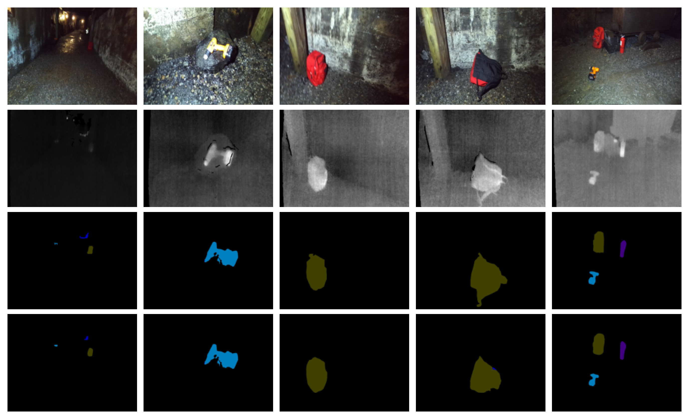

# Nonlinear spiking neural systems for thermal image semantic segmentation networks
This is the pytorch implementation of the paper

## Semantic Segmentation Result on MFNet, PST900 datasets

### Result on MFNet datasets


### Result on PST900 datasets


## Usage

### Dataset

Download datasets and place them in 'datasets' folder in the following structure:
- [MF dataset](https://www.mi.t.u-tokyo.ac.jp/static/projects/mil_multispectral/) 
- [PST900 dataset](https://github.com/ShreyasSkandanS/pst900_thermal_rgb)

### Training

#### MFNet dataset

```python
python train.py -m CSPM_SNP -b 6 -em 200
```

#### PST900 dataset

```python
python train_pst.py -m CSPM_SNP -b 2 -em 200
```

### Testing

#### MFNet Dataset
```python
python test.py
```

#### PST900 Dataset
```python
python test_pst.py
```

### Code Structure

> CSPM-SNP
>
> ​	-model : save the main model of CSPM-SNP
>
> ​	-util : the augmentation tools and DataLoader
>
> ​	train*.py : train model
>
> ​	test*.py : test model